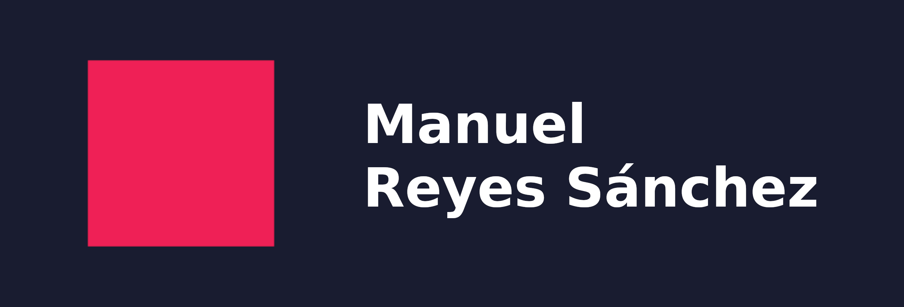

<!-- La plantilla carga custom.css -->

<picture>
  <source media="(max-width: 42em)" srcset="resources/banner_web_phone.png">
  <source media="(min-width: 42em)" srcset="resources/banner_web_desktop.png">
  
</picture>

<a class="btnmenu" href="/index">Home</a> | <a class="btnmenu" href="/phd">PhD</a> | <a class="btnmenu" href="/radio">Radio</a> | <a class="btnmenu" style="font-weight: bold;">Blog</a>

<h2 style="margin-top: 2rem;"> Blog </h2>

**Mi espacio personal para compartir textos**

<picture>
  <source media="(max-width: 42em)" srcset="img/blog_phone_1.jpg" width="1800">
  <source media="(min-width: 42em)" srcset="img/blog_phone_1.jpg" width="0">
  
</picture>

<picture>
    <source media="(max-width: 42em)" srcset="img/blog_desktop_1.jpg" width="0">
    <source media="(min-width: 42em)" srcset="img/blog_desktop_1.jpg" width="1200">
    
</picture>



---

### **<a href="{{ post.url }}">{{ post.title }}</a>**

{{ post.subtitle }}

*{{ post.fecha }}*



---
