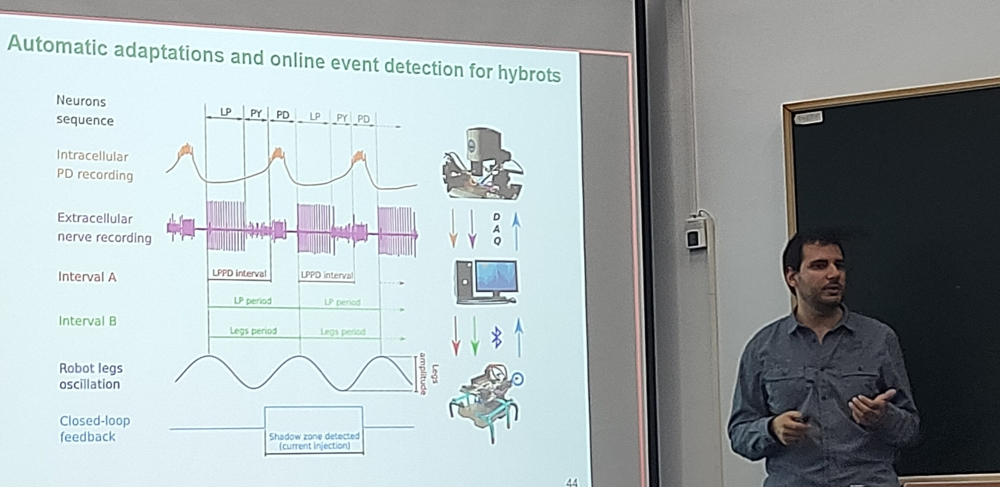
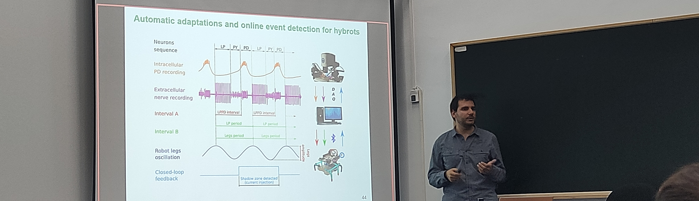

<!-- La plantilla carga custom.css -->

<picture>
  <source media="(max-width: 42em)" srcset="resources/banner_web_phone.png">
  <source media="(min-width: 42em)" srcset="resources/banner_web_desktop.png">
  
</picture>

<a class="btnmenu" href="/index">Home</a> | <a class="btnmenu" style="font-weight: bold;">PhD | <a class="btnmenu" href="/radio">Radio</a>

<h2 style="margin-top: 2rem;"> Doctoral Thesis </h2>

**Automatic signal adaptation for real-time bidirectional interaction with the nervous system.**

<picture>
  <source media="(max-width: 42em)" srcset="img/tesis_phone.jpg" width="1800">
  <source media="(min-width: 42em)" srcset="img/tesis_phone.jpg" width="0">
  
</picture>

<picture>
    <source media="(max-width: 42em)" srcset="img/tesis_desktop.jpg" width="0">
    <source media="(min-width: 42em)" srcset="img/tesis_desktop.jpg" width="1200">
    
</picture>

Closed-loop computational neuroscience thesis focused on the creation of hybrid neuronal circuits between model neurons and living neurons. These circuits are useful for addressing neuronal, synaptic and network dynamics in neuroscience research.

The work provides algorithms and adaptation protocols to create hybrid circuits automatically. Including time and amplitude scaling algorithms. Tested on electrophysiological experiments using central pattern generators. The developed software, RTHybrid, is available as an open source code.

The thesis also explores the search for dynamical invariants, cycle-by-cycle relationships between the intervals that build a neural sequence, in hybrid circuits. The results reproduce dynamical invariants in hybrid circuits for the first time using high-performance computing and genetic algorithms.

Finally, closed-loop interactions beyond biohybrid circuits are explored, such as the construction of hybrots (biohybrid robots), whose locomotion is controlled by dynamical invariants present in the activity of a biological circuit. In these experiments, the developed automatic adaptations play a key role.

<a target="_blank" href="https://repositorio.uam.es/handle/10486/712492">Library record</a> · <a target="_blank" href="https://github.com/GNB-UAM">GNB Code Repository</a> · <a target="_blank" href="https://raw.githubusercontent.com/manurs/manurs.github.io/master/mrs.bib">Citation BibTeX File</a>

## Publications

A. Garrido-Peña, P. Sanchez-Martin, M.Reyes-Sanchez, R. Levi, F.B. Rodriguez, J. Castilla, J. Tornero, P. Varona. 2024. Modulation of neuronal dynamics by sustained and activity-dependent continuous-wave near-infrared laser stimulation. <a href="https://doi.org/10.1117/1.NPh.11.2.024308" target="_blank">Neurophotonics 11: 2.</a>

M. Reyes-Sanchez, R. Amaducci, P. Sanchez-Martin, I. Elices, F.B. Rodriguez, P. Varona. 2023. Automatized offline and online exploration to achieve a target dynamics in biohybrid neural circuits built with living and model neuron. <a href="https://doi.org/10.1016/j.neunet.2023.04.034" target="_blank">Neural Networks 164: 464-475.</a>

M. Reyes-Sanchez, R. Amaducci, I. Elices, F.B. Rodriguez, P. Varona. 2020. Automatic Adaptation of Model Neurons and Connections to Build Hybrid Circuits with Living Networks. <a href="https://doi.org/10.1007/s12021-019-09440-z" target="_blank">Neuroinformatics 18: 377–393.</a>

R. Amaducci, M. Reyes-Sanchez, I. Elices, F.B. Rodriguez, P. Varona. 2019. RTHybrid: A Standardized and Open-Source Real-Time Software Model Library for Experimental Neuroscience. <a href="https://doi.org/10.3389/fninf.2019.00011" target="_blank">Frontiers in Neuroinformatics 13: 11.</a>

<ul class="nav2">

<li>
	
</li>

<li>
	
</li>

<li>
	
</li>

<li>
	
</li>

</ul>

<h2 style="margin-top: 1.0rem;"> Congress </h2>

**32th Annual Computational Neuroscience Meeting - CNS 2023, Leipzig, Germany**

A. Garrido-Peña, P. Sánchez-Martín, I. Elices, M. Reyes-Sanchez, B. Berbel, R. Latorre, F.B. Rodriguez, P. Varona. 2023. Exploring the ability of biophysical models to reproduce the functional variability of neurons (P208). <a href="https://doi.org/10.1007/s10827-024-00871-5" target="_blank">Journal of Computational Neuroscience.</a>

**31th Annual Computational Neuroscience Meeting - CNS 2022, Melbourne, Australia**

A. Garrido-Peña, P. Sánchez-Martín, M. Reyes-Sanchez, J. Castilla, J. Tornero, R. Levi, F.B. Rodriguez, P. Varona. 2022. Activity-dependent infrared laser stimulation to assess its biophysical effects on single neurons. <a href="https://doi.org/10.1007/s10827-022-00841-9" target="_blank">Journal of Computational Neuroscience 51 (Suppl 1): F3.</a>

P.E. Soëtard,  R. Amaducci, P. Sánchez-Martín, M. Reyes-Sanchez, A. Garrido-Peña, R. Levi, F.B. Rodriguez, P. Varona. 2022. Dynamical principles of functional neural sequences validated in hybrid robots built with living central pattern generators. <a href="https://doi.org/10.1007/s10827-022-00841-9"  target="_blank">Journal of Computational Neuroscience 51 (Suppl 1): P110.</a>

**30th Annual Computational Neuroscience Meeting - CNS 2021, Online**

M. Reyes-Sanchez, R. Amaducci, R. Levi, F.B. Rodriguez, P. Varona. 2021. Parameter adaptation of hybrid circuits by online exploration driven by genetic algorithms. <a href="https://doi.org/10.1007/s10827-021-00801-9" target="_blank">Journal of Computational Neuroscience 49 (Suppl 1): P192.</a>

**Computational and Systems Neuroscience - Cosyne 2021, Online**

R. Amaducci, I. Elices,  M. Reyes-Sanchez, A. Garrido-Peña, Rafael Levi, F.B. Rodriguez, P. Varona. 2021. Controlling robotic locomotion by a closed-loop interaction with living central pattern generators. Cosyne 2021.

**29th Annual Computational Neuroscience Meeting - CNS 2020, Online**

*(Speaker and organizer)* M. Reyes-Sanchez, R. Amaducci, P. Varona. 2020. Tools and techniques to bridge the gap between models and closed-loop neuroscience experiments. <a href="https://gnb-uam.github.io/CNS2020-ClosedLoopNeuroscienceTutorial" target="_blank">Closed-Loop Neuroscience Tutorial.</a>

M. Reyes-Sanchez, I. Elices, R. Amaducci, F.B. Rodriguez, P. Varona. 2020. Parameter exploration in neuron and synapse models driven by stimuli from living neuron recordings. <a href="https://doi.org/10.1186/s12868-020-00593-1" target="_blank">BMC Neuroscience 21 (Suppl 1): P206.</a>

R. Amaducci, I. Elices,  M. Reyes-Sanchez, A. Garrido-Peña, Rafael Levi, F.B. Rodriguez, P. Varona. 2020. Hybrid robot driven by a closed-loop interaction with a living central pattern generator with online feedback. <a href="https://doi.org/10.1186/s12868-020-00593-1" target="_blank">BMC Neuroscience 21 (Suppl 1): P207.</a>

**28th Annual Computational Neuroscience Meeting - CNS 2019, Barcelona, Spain**

M. Reyes-Sanchez, R. Amaducci, I. Elices Ocon, F.B. Rodriguez, P. Varona. 2019. Transfer of rich living circuit dynamics to neuron models through graded synapses. <a href="https://doi.org/10.1186/s12868-019-0538-0" target="_blank">BMC Neuroscience 20 (Suppl 1): P323.</a>

I. Elices, M. Reyes-Sanchez, R. Amaducci, R. Levi, F.B. Rodriguez, P. Varona. 2019. Hybrid circuits to assess sequential neural rhythms from low dimensional observations. <a href="https://doi.org/10.1186/s12868-019-0538-0" target="_blank">BMC Neuroscience 20 (Suppl 1): P321.</a>

R. Amaducci, I. Elices Ocon, M. Reyes-Sanchez, R. Levi, F.B. Rodriguez, P. Varona. 2019. Robotic locomotion driven by the flexible rhythm of a living Central Pattern Generator. <a href="https://doi.org/10.1186/s12868-019-0538-0" target="_blank">BMC Neuroscience 20 (Suppl 1): P322.</a>

**Society for Neuroscience - SFN Neuroscience 2018, San Diego, USA**

I. Elices, M. Reyes-Sanchez, R. Amaducci, R. Levi, F.B. Rodriguez, P. Varona. 2018. Dynamical invariants underlying robustness and flexibility in sequential neural dynamics. SFN Neuroscience 2018.

**27th Annual Computational Neuroscience Meeting - CNS 2018, Seattle, USA**

*(Oral presentation)* M. Reyes-Sanchez, I. Elices Ocon, R. Amaducci, F.B. Rodriguez, P. Varona. 2018. Assisted construction of hybrid circuits: making easy the implementation and automation of interactions between living and model neurons. <a href="https://doi.org/10.1186/s12868-018-0452-x" target="_blank">BMC Neuroscience 19 (Suppl 2): O19.</a>

R. Amaducci, M. Reyes-Sanchez, I. Elices Ocon, F.B. Rodriguez, P. Varona. 2018. A cross-platform real-time model library to build hybrid neural circuits. <a href="https://doi.org/10.1186/s12868-018-0452-x" target="_blank">BMC Neuroscience 19 (Suppl 2): P172.</a>

I. Elices Ocon, M. Reyes-Sanchez, R. Amaducci, R. Levi, F.B. Rodriguez, P. Varona. 2018. Unveiling and characterizing dynamical invariants in central pattern generators. <a href="https://doi.org/10.1186/s12868-018-0452-x" target="_blank">BMC Neuroscience 19 (Suppl 2): P173.</a>

**11th Federation of European Neuroscience Societies Forum of Neuroscience - FENS 2018, Berlin, Germany**

M. Reyes-Sanchez, R. Amaducci, I. Elices Ocon, F.B. Rodriguez, P. Varona. 2018. Auto-adaptation of neuron models to perform hybrid interactions with living neurons. FENS 2018.

I. Elices Ocon, M. Reyes-Sanchez, R. Amaducci, R. Levi, F.B. Rodriguez, P. Varona. 2018. Dynamical invariants in Central Pattern Generators. FENS 2018.

R. Amaducci, M. Reyes-Sanchez, I. Elices Ocon, F.B. Rodriguez, P. Varona. 2018. Building hybrid circuits using a multiplatform real-time software model library. FENS 2018.

**17th National Congress of the Spanish Society of Neuroscience - SENC 2017, Alicante, Spain**

M. Reyes-Sanchez, I. Elices Ocon, R. Amaducci, F.B. Rodriguez, P. Varona. 2017. Dynamic Adaptation for Hybrid Circuit Interactions. SENC 2017.

R. Amaducci, C. Muñiz, M. Reyes-Sanchez, F.B. Rodriguez, P. Varona. 2017. Standardized real-time software in experimental neuroscience. SENC 2017.

**26th Annual Computational Neuroscience Meeting - CNS 2017, Antwerp, Belgium**

M. Reyes-Sanchez, I. Elices, R. Amaducci, C. Muniz, F.B. Rodriguez, P. Varona. 2017. Automatic calibration for hybrid circuits of living and artificial neurons. <a href="https://doi.org/10.1186/s12868-017-0372-1" target="_blank">BMC Neuroscience 18 (Suppl 1, Part 3): P281.</a>

R. Amaducci, C. Muñiz, M. Reyes-Sanchez, F.B. Rodriguez, P. Varona. 2017. On the need for standardized real-time software technology in closed-loop neuroscience. <a href="https://doi.org/10.1186/s12868-017-0371-2" target="_blank">BMC Neuroscience 18 (Suppl 1, Part 2): P104.</a>

<!--

<ul class="nav2">

<li><a target="_blank" href="https://github.com/GNB-UAM" class="button">GNB Repository</a></li>
<li><a target="_blank" href="https://raw.githubusercontent.com/manurs/manurs.github.io/master/MRS.bib" class="button">BibTeX file</a></li>

<li><a target="_blank" href="https://github.com/manurs" class="button">GitHub</a></li>
<li><a target="_blank" href="https://linkedin.com/in/manuelrs/" class="button">Linkedin</a></li>

<li><a target="_blank" href="https://orcid.org/0000-0003-2909-4664" class="button">ORCID</a></li>
<li><a target="_blank" href="https://scholar.google.es/citations?user=JlKzj1cAAAAJ" class="button">Google Scholar</a></li>

</ul>

-->

